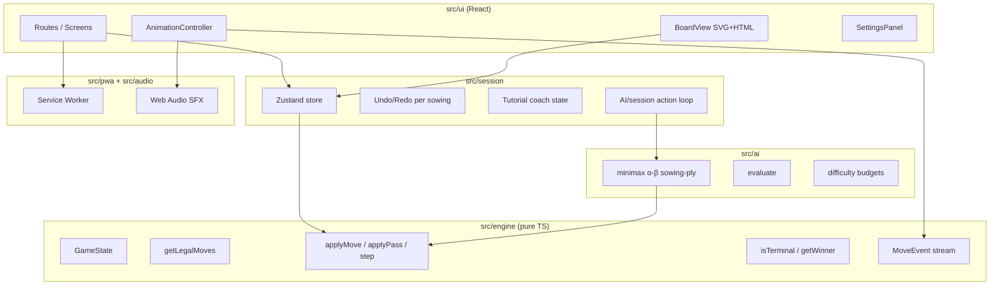
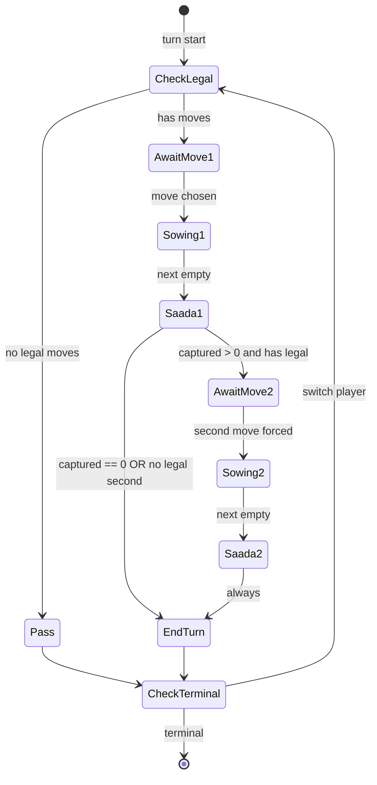
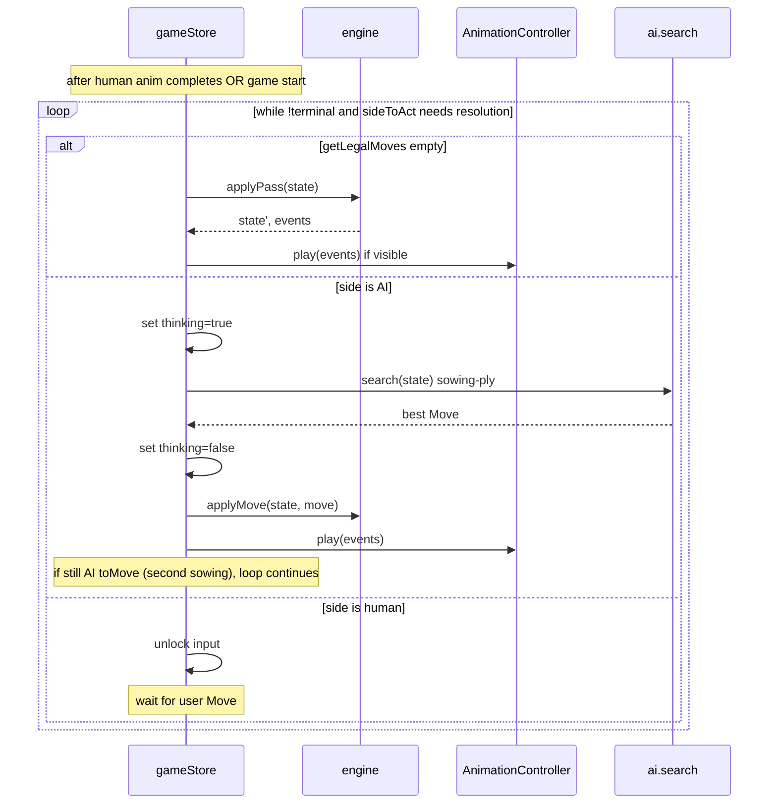
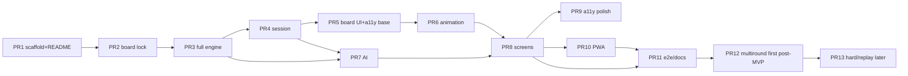
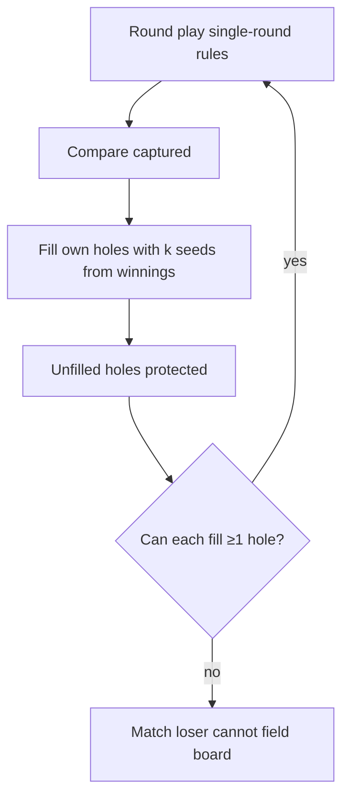

# Chennamane — Full Product & Implementation Design

| Field | Value |
| --- | --- |
| **Document** | Chennamane Browser Game — Product & Technical Design |
| **Author** | design-doc-writer |
| **Date** | 2026-07-15 |
| **Status** | Approved (user decisions incorporated) |
| **Repo** | `/Users/cristonmascarenhas/orca/projects/chennamane` (greenfield; git only) |
| **Primary English spelling** | **Chennamane** (alternates *Chennemane* / *Chenne Mane* only in About) |
| **Engine default rules** | Ali Guli Mane / Karnataka formalization (this doc + golden tests) |
| **MVP variant label** | **Bule Perga** (2-player harvest form) |

### Source-of-truth hierarchy (rules)

1. **Golden tests & executable fixtures in this doc** (Appendix A)
2. **This document’s formalization** (Canonical v1 Ruleset)
3. **Wikipedia** [Ali Guli Mane](https://en.wikipedia.org/wiki/Ali_Guli_Mane) — primary narrative source (note: article has citation-needed banner; thin secondary sourcing)
4. **Mancala World / family accounts** — inform **variant flags only** (e.g. fixed anti-clockwise), not silent overrides of (1)–(2)

---

## Overview

**Chennamane** is a browser-native abstract strategy game implementing the South Indian mancala tradition known as *Ali Guli Mane* (Kannada), *Chenne Mane / Chennemane* (Tulu Nadu), and related coastal Karnataka forms. The product brands the experience as **Chennamane** with Tulunadu cultural framing, while the rules engine defaults to a **well-specified Ali Guli Mane formalization** of multi-lap sowing (*pussa kanawa*), *saada* termination, paired capture, and a **forced** second sowing after a successful capture (when a legal start remains).

This is a **greenfield** project: no existing stack, UI, or engine. The design prioritizes (1) a pure, fully tested TypeScript rules engine with zero DOM coupling, (2) an animation event stream that keeps presentation deterministic, (3) delightful mobile-first UX with accessibility and offline PWA support, and (4) a minimax/alpha-beta AI (Easy + Medium) suitable for phones, searching in **sowing-plies** (not full turns). Post-MVP workstreams are phased; **first post-MVP priority is multi-round handicap** (ahead of online multiplayer, i18n, Hard AI, and replay). MVP keeps only a `protectedMask: false[]` stub so `nextPit` stays stable.

The shippable MVP is a **single-round Bule Perga** experience: local hot-seat 2P, Player vs AI (**Easy + Medium only**), animated sowing/capture, interactive rules coach, settings (default **5 seeds/pit**), undo/redo, and installable offline PWA — no accounts.

---

## Background & Motivation

### Cultural context

Chennamane is a mancala-family game from **Karnataka / Tulu Nadu (coastal Karnataka)**. The name describes the board: a wooden block with holes; *chenne* refers to coral/red lucky seeds (*gulaganji* / *manjotti*), historically also played with tamarind seeds or cowries. It is traditionally associated with **Aati** (monsoon month) when farm work slows. Terminology carries agricultural metaphor: **Bule Perga** ≈ produce earned; **Muguli** ≈ three seeds / germination imagery in some local teaching.

Regional diversity is large (~40 named house variants are sometimes claimed in Tulunadu accounts). Board dimensions are not standardized on physical boards. Related games include Tamil **Pallanguzhi**, Malay **Congkak** (especially multi-round handicap), and Western **Kalah** (different geometry and store semantics).

**Spelling:** Product English string is locked as **Chennamane**. About may note Wikipedia/Tulu variants (*Chennemane*, *Chenne Mane*) without renaming the app, PWA manifest, or package.

### Why a browser product

1. **Preservation + access**: Traditional boards and seasonal play are less common in urban households; a free offline web game lowers the barrier for intergenerational teaching.
2. **Rules ambiguity in sources**: Family blogs, Wikipedia, and Mancala World disagree on direction, seed count, and capture edge cases. A product needs a **canonical engine config** plus explicit variant knobs — not ad-hoc UI special cases.
3. **Abstract-game craft**: Multi-lap sowing with direction choice creates a larger branching factor than Kalah; good AI + animation feedback is the difference between “seed counter” and a real strategy game.

### Current state

Empty repository (`.git` only). No code, conventions, or CI. This document is the first engineering artifact.

### Pain points this design solves

| Pain | Mitigation |
| --- | --- |
| Conflicting rule sources | Hierarchy above; golden fixture in Appendix A; variant flags for CCW-only etc. |
| Animation desync from rules | Engine event stream; dual committed/display; abort generation on undo |
| Rules-heavy logic mixed with React | Pure `src/engine`; no React imports in engine |
| Mobile AI lag | Sowing-ply depth/time budgets; iterative deepening; thinking indicator |
| Empty-side softlocks | Explicit `applyPass` in public API; session + AI must use it |
| Cultural mislabeling | Brand Chennamane / Bule Perga; engine cites AGM formalization |

---

## Goals & Non-Goals

### Goals (MVP)

1. Ship a correct, unit-tested **Bule Perga** single-round rules engine (14 pits, default 5 seeds, bidirectional sowing, saada + capture + forced second sowing on capture).
2. Deliver **hot-seat 2P** and **vs AI** (**Easy + Medium only** for first public launch; Hard is post-MVP).
3. Present **animated** seed-by-seed sowing, capture highlights, saada feedback, and direction chooser (with skip/fast-forward).
4. Provide **first-run interactive coach** + static rules screen.
5. **Mobile-first** responsive UI (portrait phone + landscape desktop), touch + mouse + keyboard.
6. **A11y from first board PR**: pit buttons, basic ARIA labels, focus order; full keyboard chooser + axe in follow-up.
7. Settings: seeds (4/5/6), direction mode, animation speed, sound, legal-move hints — **apply on next `newGame` only**.
8. Match controls: undo/redo (per sowing), resign, new game, score panel, turn indicator.
9. **PWA**: installable, offline after first load, explicit SW update strategy.
10. No accounts / no server required for MVP.

### Non-Goals (MVP)

- Online multiplayer, matchmaking, accounts, leaderboards.
- Full multi-round handicap UI/play (only `protectedMask` all-false stub in MVP engine) — **first post-MVP workstream (PR 12)**.
- **Hard AI** and shareable replay (post-MVP / later; not first public launch).
- i18n (Kannada/Tulu) — after multi-round unless product priority changes.
- 3-player *Arasu Aate*, solitaire *Seete Aata*, or full ~40 regional variants.
- `VariantModule` plugin interface (premature; plain functions + config flags only).
- Native mobile apps (Capacitor/React Native).
- Monetization, ads, analytics SDKs beyond optional privacy-friendly page views later.
- Pixel-perfect historical board CAD fidelity; aesthetic is “inspired wood board,” not museum replica.
- Wikipedia-mentioned 7/12 seeds-per-pit setups (out of knobs; uncommon for our Bule Perga target — can add later without topology change).

### Success metrics (engineering)

| Metric | Target |
| --- | --- |
| Engine unit tests | ≥ 40 table-driven cases; 100% of formalized rule branches |
| Seed conservation property | Always holds for non-terminal transitions |
| AI Easy move time | p95 < 200 ms on mid-range phone (2022+ Android/iOS) |
| AI Medium move time | p95 < 1.0 s same device |
| Animation | 60 fps sustained during sowing on mid phone (reduced-motion opt-out) |
| Lighthouse PWA / Perf | Installable; Performance ≥ 90 desktop, ≥ 80 mobile (Moto G Power / mid iPhone profile proxy in CI or manual) |
| Bundle (gzip JS) | Initial interactive ≤ ~180 KB gzip (engine+UI shell); AI can lazy-load |

---

## Canonical v1 Ruleset (Bule Perga / Ali Guli Mane formalization)

This section is **authoritative for implementation**. Regional differences are expressed only as `VariantConfig` fields.

### Identity

| Concept | v1 choice |
| --- | --- |
| Product name | **Chennamane** (locked English spelling) |
| Playable variant name | Bule Perga |
| Geometry | 2 × 7 play pits (14 total). No on-board stores in the sowing circuit |
| Ownership | South owns pits `0..6` (nearest UI bottom); North owns `7..13` |
| Score stores | Off-board integer counters only; **not** sowing destinations in default rules |
| Pieces | Abstract “seeds”; UI may render as red gulaganji-style counters |

### Initial setup

- Default (locked for new games): **5 seeds × 14 pits = 70 seeds**.
- Variant knobs in Settings: `initialSeedsPerPit ∈ {4, 5, 6}` → totals 56 / 70 / 84; **factory default remains 5**.
  - **Why not 7/12:** Wikipedia mentions them as possible fills; they are rare for casual Bule Perga teaching and bloat settings. Topology supports any k later.
- First player: `random | south | north | userChoice` (default `random` for vs AI with human as South; hot-seat: user choice dialog). Random uses **injected `rng` only** (no `Math.random` inside pure apply paths).
- Captured scores start at 0 for both players.
- `protectedMask`: length-14 `false` array in single-round mode (skip logic in `nextPit` ready; reseed UI post-MVP).

### Board indexing (LOCKED)

This mapping is **normative**. All golden tests, coach copy, and Wikipedia label helpers use it.

```
Logical layout (South at bottom of screen):

  North (Player N) — far row, left → right from South's view:
  index:  7   8   9  10  11  12  13
  N-id:  N0  N1  N2  N3  N4  N5  N6
  Wiki:  A1  A2  A3  A4  A5  A6  A7

  South (Player S) — near row, left → right:
  index:  0   1   2   3   4   5   6
  S-id:  S0  S1  S2  S3  S4  S5  S6
  Wiki:  B1  B2  B3  B4  B5  B6  B7

opposite(i) = (i + 7) % 14
  0↔7, 1↔8, 2↔9, 3↔10, 4↔11, 5↔12, 6↔13
  e.g. opposite(A3=9) = B3=2
```

```ts
export const LABEL_TO_INDEX: Record<string, number> = {
  A1: 7, A2: 8, A3: 9, A4: 10, A5: 11, A6: 12, A7: 13,
  B1: 0, B2: 1, B3: 2, B4: 3, B5: 4, B6: 5, B7: 6,
};
```

### Direction rings (LOCKED to Wikipedia anti-clockwise)

Wikipedia: an **anti-clockwise** sowing that ends such that the next hole is empty at **A4** captures **A3** and **B3**. Along the A-row that implies order **A5 → A4 → A3** (decreasing A labels / decreasing North indices under our map).

Therefore engine direction **`ccw` MUST** advance:

`… → A5(11) → A4(10) → A3(9) → …`

**Locked rings** (starting listing at S0 for readability; use `indexOf` + step for any from):

```ts
// Engine 'ccw' === Wikipedia "anti-clockwise" under LABEL_TO_INDEX above.
// South L→R, then North R→L:
// S0→S1→S2→S3→S4→S5→S6→N6→N5→N4→N3→N2→N1→N0→(S0)
// Indices: 0,1,2,3,4,5,6,13,12,11,10,9,8,7
export const CCW_RING = [0, 1, 2, 3, 4, 5, 6, 13, 12, 11, 10, 9, 8, 7] as const;

// Engine 'cw' === reverse of CCW_RING:
// S0→N0→N1→N2→N3→N4→N5→N6→S6→S5→S4→S3→S2→S1→(S0)
// Indices: 0,7,8,9,10,11,12,13,6,5,4,3,2,1
export const CW_RING = [0, 7, 8, 9, 10, 11, 12, 13, 6, 5, 4, 3, 2, 1] as const;
```

**Normative statement for implementers:**

> Wikipedia’s anti-clockwise golden example uses engine direction **`ccw`** under map `A1=N0…A7=N6`, `B1=S0…B7=S6`.

**UX copy:** Prefer arrow graphics labeled “this way / that way” in the direction chooser; optional text “anti-clockwise (classic)” may map to `ccw` only after the above lock. Do not rely on player spatial intuition of the word alone.

```ts
function nextPit(from: PitIndex, dir: 'cw' | 'ccw', protectedMask: boolean[]): PitIndex {
  const ring = dir === 'ccw' ? CCW_RING : CW_RING;
  const pos = ring.indexOf(from);
  let i = (pos + 1) % 14;
  let guard = 0;
  while (protectedMask[ring[i]] && guard++ < 14) {
    i = (i + 1) % 14;
  }
  if (guard >= 14) throw new EngineError('ALL_PROTECTED', 'no un-protected pit in ring');
  return ring[i] as PitIndex;
}
```

Sanity checks (unit tests in PR 2):

| from | dir | next | label path |
| --- | --- | --- | --- |
| 11 (A5) | `ccw` | 10 (A4) | A5→A4 |
| 10 (A4) | `ccw` | 9 (A3) | A4→A3 |
| 9 (A3) | `ccw` | 8 (A2) | A3→A2 |
| 11 (A5) | `cw` | 12 (A6) | A5→A6 |

### Core turn — *Pussa Kanawa* (multi-lap sowing)

A **turn** consists of one or two **sowings**. Each sowing ends in a **saada**.

#### Legal starting pit / move generation (call graph, no cycles)

**Dependency order (normative — do not invert):**

1. `hasLegalMove(state, player)` — **primitive**; never calls `getLegalMoves` or `isTerminal`
2. `getLegalMoves(state)` — uses `hasLegalMove` / pit scans only; **never** calls `isTerminal`
3. `isTerminal(state)` — may call `hasLegalMove` (or, in MVP, only seeds/resign — see below)

```ts
/** Primitive: does this player have any sowable pit? No recursion into isTerminal/getLegalMoves. */
function hasLegalMove(state: GameState, player: PlayerId): boolean {
  for (const pit of ownedPits(player)) {
    if (state.protectedMask[pit]) continue;
    if (state.pits[pit] > 0) return true;
  }
  return false;
}

function getLegalMoves(state: GameState): Move[] {
  // Do NOT call isTerminal here (would re-enter hasLegalMove via isTerminal and risk cycles
  // if someone later rewrites hasLegalMove in terms of getLegalMoves).
  if (state.resigned !== null) return [];
  if (totalBoardSeeds(state) === 0) return [];
  const player = state.toMove;
  if (!hasLegalMove(state, player)) return [];
  const dirs =
    state.config.directionMode === 'bidirectional' ? (['cw', 'ccw'] as const)
    : state.config.directionMode === 'fixedCcw' ? (['ccw'] as const)
    : (['cw'] as const);
  const moves: Move[] = [];
  for (const pit of ownedPits(player)) {
    if (state.protectedMask[pit]) continue;
    if (state.pits[pit] <= 0) continue;
    for (const direction of dirs) moves.push({ startPit: pit, direction });
  }
  return moves;
}
```

Rules:

- Only **current** `toMove`’s row.
- Pit ≥ 1 seed, not protected.
- Directions filtered by `directionMode`.
- Legal on **first and second** sowing while that player still owns the turn (`awaitingSecondSowing` does not change ownership of `toMove`).
- Empty if resigned, board empty, or current player has no sowable pit.
- Opponent pits never legal.
- **Anti-pattern (forbidden):** `hasLegalMove = (s,p) => getLegalMoves({...s, toMove:p}).length > 0` when `getLegalMoves` calls `isTerminal` that calls `hasLegalMove`.

#### Player inputs per sowing

1. `startPit` — owned non-empty pit.
2. `direction` — as above.

#### Sowing loop (precise)

```
procedure executeSowing(state, player, startPit, direction) → { state', events, capturedTotal }
  assert move is among getLegalMoves(state)
  hand ← state.pits[startPit]
  state.pits[startPit] ← 0
  emit pickup(startPit, hand)
  current ← startPit
  drops ← 0

  while hand > 0:
    drops ← drops + 1
    if drops > MAX_DROPS:  // e.g. 10_000
      throw EngineError('MAX_DROPS_EXCEEDED', ...)
    current ← nextPit(current, direction, state.protectedMask)
    state.pits[current] ← state.pits[current] + 1
    hand ← hand - 1
    emit drop(current, remainingInHand: hand)

    if hand == 0:
      peek ← nextPit(current, direction, state.protectedMask)
      if state.pits[peek] > 0:
        hand ← state.pits[peek]
        state.pits[peek] ← 0
        current ← peek
        emit continue(peek, hand)
      else:
        emit saada(emptyPit: peek)
        capturePit ← nextPit(peek, direction, state.protectedMask)
        opp ← opposite(capturePit)
        amount1 ← state.pits[capturePit]
        amount2 ← state.pits[opp]
        // Always zero both pits and emit capture (even if amounts are 0,0)
        state.pits[capturePit] ← 0
        state.pits[opp] ← 0
        capturedTotal ← amount1 + amount2
        state.score[player] += capturedTotal
        emit capture(pits: [capturePit, opp], amounts: [amount1, amount2])
        return { state, events, capturedTotal }
```

**Invariants**

- `sum(pits) + score.S + score.N + hand === initialTotal` at any check point inside sowing (`assertInvariants(state, hand)`).
- After sowing completes, `hand === 0` and `sum(pits)+scores === initialTotal`.
- Never drop into a store; stores are scores only.
- Capture of already-empty pits yields 0 — still emit `capture` for UI/saada feedback.

#### Capture formalization (Wikipedia-aligned)

When saada occurs because **next after last drop** is empty at `E`:

- Capture contents of succeeding hole `C = next(E, dir)`.
- Also capture `opposite(C)` — opposite the **captured** hole, not the empty.
- Wikipedia: anti-clockwise, empty at **A4** → capture **A3** and **B3**.

See **Appendix A** for the concrete numeric golden fixture.

#### Extra sowing / turn end (FORCED second sowing)

| Captured total on first saada | Effect |
| --- | --- |
| `> 0` **and** `hasLegalMove` after capture | Player **must** take a second sowing (`awaitingSecondSowing = true`; `toMove` unchanged). UI does not offer “skip second sowing.” |
| `> 0` but **no** legal pits remain | Turn ends (`turnEnd` reason `no-legal-second-sowing`); switch player. |
| `== 0` | Turn ends (`turnEnd` reason `saada-no-capture`); switch player. **No** second sowing. |

After second sowing’s saada (whether or not it captured): turn ends (`second-saada`); switch player.

Rationale: Wikipedia’s “can take two sowings” is permissive; competitive digital play **forces** the second sowing when legal — simpler state machine, no skip UI, AI always expands the node.

### Turn bookkeeping helpers (normative)

```ts
function endTurnSwitch(state: GameState): GameState {
  return {
    ...state,
    toMove: state.toMove === 'S' ? 'N' : 'S',
    sowingsUsedThisTurn: 0,
    awaitingSecondSowing: false,
  };
}

function afterSowing(state: GameState, capturedTotal: number, events: MoveEvent[]): {
  state: GameState;
  events: MoveEvent[];
} {
  const player = state.toMove;

  if (!state.awaitingSecondSowing && state.sowingsUsedThisTurn === 0) {
    // Just finished first sowing of the turn
    let next = { ...state, sowingsUsedThisTurn: 1 as const };
    if (capturedTotal > 0 && hasLegalMove(next, player)) {
      next = { ...next, awaitingSecondSowing: true };
      // do NOT switch player; no turnEnd yet
      return { state: next, events };
    }
    const reason = capturedTotal > 0 ? 'no-legal-second-sowing' : 'saada-no-capture';
    events = [...events, { type: 'turnEnd', player, reason }];
    next = endTurnSwitch({ ...next, awaitingSecondSowing: false });
    return maybeMatchEnd(next, events);
  }

  // Finished second sowing
  events = [...events, { type: 'turnEnd', player, reason: 'second-saada' }];
  let next = endTurnSwitch({
    ...state,
    sowingsUsedThisTurn: 2,
    awaitingSecondSowing: false,
  });
  return maybeMatchEnd(next, events);
}

/**
 * After a turn-ending action (sowing that switches player, or path that may clear the board).
 * If the position is terminal, append matchEnd. Does not mutate non-terminal state.
 * Event order when terminal: … → turnEnd (already in events) → matchEnd.
 * Flipping toMove via endTurnSwitch before this call is intentional and harmless when terminal.
 */
function maybeMatchEnd(
  state: GameState,
  events: MoveEvent[]
): { state: GameState; events: MoveEvent[] } {
  if (!isTerminal(state)) return { state, events };
  const winner = getWinner(state)!; // non-null when isTerminal
  return {
    state,
    events: [
      ...events,
      { type: 'matchEnd', winner, scores: { ...state.score } },
    ],
  };
}

/**
 * Used when applyPass discovers the opponent also has no legal moves (or board already empty).
 * Same event payload as maybeMatchEnd; named separately for call-site clarity after pass.
 * Assumes turnEnd(reason:'pass') was already pushed. Always emits matchEnd.
 */
function finalizeTerminal(
  state: GameState,
  events: MoveEvent[]
): { state: GameState; events: MoveEvent[] } {
  // Invariant: isTerminal(state) === true (caller responsibility; assert in DEV)
  const winner = getWinner(state) ?? 'draw';
  return {
    state,
    events: [
      ...events,
      { type: 'matchEnd', winner, scores: { ...state.score } },
    ],
  };
}
```

**Clearing capture path:** last seeds leave the board during `executeSowing` → `afterSowing` → (possibly) `endTurnSwitch` → `maybeMatchEnd` appends `matchEnd` with winner by score. No separate “capture ends match” branch.

#### State-transition table (core fields)

| Pre: `sowingsUsed` | Pre: `awaitingSecond` | Event | Post: `sowingsUsed` | Post: `awaitingSecond` | Post: `toMove` |
| --- | --- | --- | --- | --- | --- |
| 0 | false | first sowing, capture>0, has moves | 1 | true | same |
| 0 | false | first sowing, capture>0, no moves | 0 (via endTurn) | false | flipped |
| 0 | false | first sowing, capture==0 | 0 (via endTurn) | false | flipped |
| 1 | true | second sowing (any capture) | 0 (via endTurn) | false | flipped |
| * | * | `applyPass` | 0 | false | flipped (or terminal) |
| * | * | resign | unchanged then terminal | — | — |

Note: after `endTurnSwitch`, `sowingsUsedThisTurn` is always **0** for the incoming player.

### Pass API (normative public)

When `getLegalMoves(state)` is empty but the position is **not** terminal (opponent may still have seeds on their row), the side to move **must pass**.

```ts
export type Action = Move | { type: 'pass' };

/** Legal only when !isTerminal(state) && getLegalMoves(state).length === 0 */
export function applyPass(state: GameState): { state: GameState; events: MoveEvent[] } {
  if (isTerminal(state)) throw new EngineError('ILLEGAL_PASS', 'already terminal');
  if (getLegalMoves(state).length > 0) throw new EngineError('ILLEGAL_PASS', 'moves exist');

  const player = state.toMove;
  let events: MoveEvent[] = [{ type: 'pass', player }];
  let next = endTurnSwitch(state);
  events.push({ type: 'turnEnd', player, reason: 'pass' });

  // Prefer maybeMatchEnd for all post-pass checks (MVP: matchEnd only if board empty).
  // finalizeTerminal is equivalent when caller already knows isTerminal — e.g. post-MVP
  // if (!hasLegalMove(next,'S') && !hasLegalMove(next,'N')) return finalizeTerminal(next, events).
  return maybeMatchEnd(next, events);
}

/** Optional umbrella for session/AI */
export function step(state: GameState, action: Action): { state: GameState; events: MoveEvent[] } {
  if (action.type === 'pass') return applyPass(state);
  return applyMove(state, action);
}
```

**Session and AI MUST** call `applyPass` (or `step` with pass) when `getLegalMoves` is empty and `!isTerminal`. Never busy-wait or soft-lock.

`turnEnd.reason` includes `'pass'`.

### Match end — single-round (MVP) — LOCKED PACKAGE

External sources mainly say the game ends when **all seeds are captured**. Single-round stalemate with seeds left on the board is thinly documented; we **lock** the following package for MVP (implementable, testable, school-friendly):

| Rule | MVP lock |
| --- | --- |
| (a) Pass | If `toMove` has no legal moves and not terminal → `applyPass` |
| (b) Terminal (MVP) | Board empty (`sum(pits)===0`) **OR** resign. (Post-MVP: also both players `!hasLegalMove` when protection can strand seeds.) |
| (c) Stranded seeds | **Unclaimed** — not added to either score |
| (d) Winner | Higher `score` only; equal → draw |
| (e) `leftoverSeedsPolicy` | Fixed `'unclaimed'` in MVP; remove alternate from runtime config (may reappear post-MVP) |

```ts
/**
 * MVP: resign or empty board only.
 * (Both players lacking sowable pits ⇔ empty board while protectedMask is all false,
 *  so a both-no-moves branch would be redundant and is omitted to keep the call graph simple.)
 *
 * Post-MVP (protected pits): also return true when
 *   !hasLegalMove(state, 'S') && !hasLegalMove(state, 'N')
 * using the primitive hasLegalMove only — never getLegalMoves.
 */
function isTerminal(state: GameState): boolean {
  if (state.resigned !== null) return true;
  if (totalBoardSeeds(state) === 0) return true;
  return false;
}

function getWinner(state: GameState): PlayerId | 'draw' | null {
  if (!isTerminal(state)) return null;
  if (state.resigned === 'S') return 'N';
  if (state.resigned === 'N') return 'S';
  if (state.score.S > state.score.N) return 'S';
  if (state.score.N > state.score.S) return 'N';
  return 'draw';
}
```

No `consecutivePassCount` field is required: terminal is a pure function of resign + board seeds (MVP). One-sided empty row is **not** terminal — use `applyPass`. If after pass the board is empty or (post-MVP) both lack moves, `finalizeTerminal` / `maybeMatchEnd` emit `matchEnd`.

**Golden terminal cases** (required tests):

1. Full clear-by-capture: all pits 0 → terminal, winner by score.
2. South row all empty, North has seeds → South to move passes; North continues.
3. Both rows have no seeds in own pits but… (if all pits empty, case 1). If somehow seeds only exist in a configuration where both cannot move: both sides empty of own seeds with seeds only… actually seeds always sit in some pit owned by someone. “No legal moves for player P” = all pits on P’s row are 0 (or protected). So both no legal moves ⇔ both rows empty ⇔ board empty.  

**Correction for stranded seeds:** With only “must sow from own row,” if South’s row is empty and North’s row has seeds, only North can move. When North also empties their ability… North always has legal moves while any seed remains on North’s row. Seeds on South’s row give South legal moves. Therefore **both have no legal moves iff every pit is empty** (ignoring protected-all edge in multi-round).

Then when are stranded seeds possible? **Only with protected pits (v1.1)** or if we later forbid moves from pits that cannot complete — not MVP.

**MVP simplification:** Without protected pits, `!hasLegalMove(S) && !hasLegalMove(N)` ⇔ board empty. Pass still matters: when South’s row is empty and North’s is not, South **passes** so North can continue capturing. Pass is not optional flavor — it is required for empty-side continuity.

Revised terminal package (still locked):

| Rule | MVP lock |
| --- | --- |
| Pass | Required when `toMove` has empty own row (no legal moves) and opponent may still move |
| Terminal | `sum(pits)===0` OR resign (or both no moves — equivalent to empty board in MVP without protection) |
| Stranded | N/A in MVP single-round without protection; policy still **unclaimed** if we ever emit residual |
| Winner | By `score`; resign → opponent wins |

Keep `applyPass` even though “both no moves” collapses to empty board — because **one-sided empty** is common mid-game.

### Multi-round handicap (first post-MVP workstream)

After round scores, re-seed from winnings; unfilled holes become **protected**; skipped by `nextPit`. Match ends when a player cannot fill one hole.

MVP: `protectedMask` all false; **no** `reseedForNextRound` on the critical path. **After MVP ships, PR 12 (multi-round) is the first post-MVP priority** — ahead of online multiplayer, i18n, Hard AI, and replay.

### Variant configuration object

```ts
export type DirectionMode = 'bidirectional' | 'fixedCcw' | 'fixedCw';

export interface VariantConfig {
  id: 'bule-perga';
  displayName: 'Bule Perga';
  rows: 2;
  pitsPerRow: 7;
  initialSeedsPerPit: 4 | 5 | 6; // default 5
  directionMode: DirectionMode;  // default 'bidirectional'
  /** Serialization forward-compat only — MVP implements exactly one rule in plain code */
  captureRule: 'wiki-succeeding-and-opposite';
  secondSowingOnCapture: true; // forced when legal
  emptyCaptureGrantsSecondSowing: false;
  storesInCircuit: false;
  multiRound: false; // MVP always false
  maxSowingsPerTurn: 2;
}
```

**No `VariantModule` plugin interface in MVP.** Plain functions; add plugins only when a second real ruleset ships.

---

## Proposed Design

### High-level architecture



### Design principles

1. **Engine purity**: No DOM/React; RNG only via injected `rng` at `createGame`.
2. **Events over side effects**: `applyMove` / `applyPass` return `{ state, events }`.
3. **Immutable state**: New state objects; copy pits array on write.
4. **AI = engine client**: Silent apply in search; re-apply with events for presentation.
5. **Config over forks**: Flags, not UI special cases — but **no** premature plugin registry.
6. **Settings apply on next game**: Never mutate in-flight `committed.config` from Settings screen.

### Module layout

```
chennamane/
├── package.json
├── pnpm-lock.yaml
├── README.md                 # scripts: dev / test / build (PR 1)
├── vite.config.ts
├── tsconfig.json
├── index.html
├── public/
│   ├── icons/
│   ├── manifest.webmanifest
│   └── og-image.png
├── src/
│   ├── main.tsx
│   ├── app/
│   ├── engine/
│   │   ├── index.ts
│   │   ├── types.ts
│   │   ├── board.ts          # LABEL_TO_INDEX, rings, opposite, nextPit
│   │   ├── state.ts
│   │   ├── moves.ts
│   │   ├── apply.ts          # applyMove, executeSowing
│   │   ├── pass.ts           # applyPass
│   │   ├── step.ts           # step(action)
│   │   ├── turn.ts           # endTurnSwitch, afterSowing
│   │   ├── terminal.ts
│   │   ├── events.ts
│   │   ├── errors.ts         # EngineError
│   │   ├── config.ts
│   │   └── invariants.ts
│   ├── ai/
│   ├── session/
│   ├── ui/
│   ├── audio/
│   └── pwa/
├── tests/
│   ├── engine/
│   │   ├── board.orientation.test.ts
│   │   ├── sowing.test.ts
│   │   ├── capture.wiki.golden.test.ts  # Appendix A fixture
│   │   ├── turn.secondSowing.test.ts
│   │   ├── pass.test.ts
│   │   ├── terminal.test.ts
│   │   ├── legalMoves.test.ts
│   │   ├── edgeCases.test.ts
│   │   └── properties.test.ts
│   ├── ai/
│   └── e2e/
└── docs/
    └── RULES.md
```

### Game state types

```ts
export type PlayerId = 'S' | 'N';
export type PitIndex = number; // 0..13
export type Direction = 'cw' | 'ccw';

export interface GameState {
  pits: number[]; // length 14
  score: Record<PlayerId, number>;
  toMove: PlayerId;
  /** Sowings completed in the current player's turn before the pending action (0 or 1 mid-turn). Reset to 0 on endTurnSwitch. */
  sowingsUsedThisTurn: 0 | 1 | 2;
  awaitingSecondSowing: boolean;
  protectedMask: boolean[]; // length 14, all false in MVP
  config: VariantConfig;
  resigned: PlayerId | null;
  round: number; // 1 in MVP
  /** Fixed at createGame from config.initialSeedsPerPit * 14 */
  initialTotal: number;
}

export interface Move {
  startPit: PitIndex;
  direction: Direction;
}

export type MoveEvent =
  | { type: 'pickup'; pit: PitIndex; count: number }
  | { type: 'drop'; pit: PitIndex; remainingInHand: number }
  | { type: 'continue'; pit: PitIndex; count: number }
  | { type: 'saada'; emptyPit: PitIndex }
  | { type: 'capture'; pits: PitIndex[]; amounts: number[] }
  | { type: 'pass'; player: PlayerId }
  | { type: 'turnEnd'; player: PlayerId; reason:
      | 'saada-no-capture'
      | 'second-saada'
      | 'no-legal-second-sowing'
      | 'pass'
      | 'resign'
      | 'terminal' }
  | { type: 'matchEnd'; winner: PlayerId | 'draw'; scores: Record<PlayerId, number> };

export class EngineError extends Error {
  constructor(public code: string, message: string) {
    super(message);
    this.name = 'EngineError';
  }
}
```

### State machine (turn)



### Session / AI runtime loop



**Session loop pseudo-code (normative):**

```ts
async function resolveNonHumanOrPass() {
  while (!isTerminal(committed) && !inputLocked) {
    const moves = getLegalMoves(committed);
    if (moves.length === 0) {
      const { state, events } = applyPass(committed);
      await commitAndAnimate(state, events);
      continue;
    }
    if (mode === 'ai' && committed.toMove !== humanPlayer) {
      setThinking(true);
      const move = await search(committed, difficulty); // may yield to raf
      setThinking(false);
      if (animationGeneration !== genAtStart) return; // cancelled
      const { state, events } = applyMove(committed, move);
      await commitAndAnimate(state, events);
      continue; // handles AI second sowing
    }
    break; // human to move with legal options
  }
}
```

Human second sowing: after first sowing anim, `awaitingSecondSowing && toMove === human` → input unlocks; user must move again (no skip).

### Rules formalization — pure API

```ts
export function createGame(
  config?: Partial<VariantConfig>,
  opts?: { firstPlayer?: PlayerId; rng?: () => number }
): GameState;

export function getLegalMoves(state: GameState): Move[];
export function hasLegalMove(state: GameState, player: PlayerId): boolean;

export function applyMove(state: GameState, move: Move): { state: GameState; events: MoveEvent[] };
export function applyMoveSilent(state: GameState, move: Move): GameState;
export function applyPass(state: GameState): { state: GameState; events: MoveEvent[] };
export function step(state: GameState, action: Action): { state: GameState; events: MoveEvent[] };

export function isTerminal(state: GameState): boolean;
export function getWinner(state: GameState): PlayerId | 'draw' | null;

export function resign(state: GameState, player: PlayerId): { state: GameState; events: MoveEvent[] };

export function assertInvariants(state: GameState, hand?: number): void;
export function endTurnSwitch(state: GameState): GameState; // exported for tests
// maybeMatchEnd / finalizeTerminal: module-private helpers (tested via applyMove/applyPass)
```

`applyMove` orchestration:

```
function applyMove(state, move):
  if isTerminal(state): throw ILLEGAL_MOVE
  if move not in getLegalMoves(state): throw ILLEGAL_MOVE
  { state, events, capturedTotal } = executeSowing(...)
  return afterSowing(state, capturedTotal, events)
```

`resign(state, player)`: sets `resigned`, emits `turnEnd(resign)` + `matchEnd`, regardless of `awaitingSecondSowing` or mid-turn.

### React component tree (sketch)

```
App
├── Router
│   ├── HomeScreen
│   ├── GameScreen
│   │   ├── TopBar (undo, redo, resign, hints, skip animation)
│   │   ├── ScorePanel
│   │   ├── TurnBanner (+ “Thinking…” when AI)
│   │   ├── BoardView (pit buttons + ARIA from PR 5)
│   │   ├── DirectionChooser
│   │   ├── CoachOverlay?
│   │   └── ResultModal
│   ├── RulesScreen
│   └── SettingsScreen
└── ToastRegion (aria-live)
```

### Board rendering: SVG + CSS

SVG decorative wood + HTML grid of **focusable pit `<button>`** elements (not canvas hit-testing). ARIA labels from day one of board UI.

### Animation model

```ts
// Dual state
// committed: engine truth (history pushes this)
// displayPits / displayScore: visual lag

let animationGeneration = 0;

async function play(events: MoveEvent[], gen: number) {
  inputLocked = true;
  const speed = effectiveDropMs(); // reduced-motion → 0 batch
  const batchDrops = prefersReducedMotion || events.filter(e => e.type==='drop').length > 40;

  for (const e of events) {
    if (gen !== animationGeneration) return; // aborted
    switch (e.type) {
      case 'pickup': animateHand(e); break;
      case 'drop':
        if (batchDrops) { displayPits[e.pit]++; break; }
        await animateDrop(e, speed);
        sfx.drop();
        break;
      case 'continue': flashContinue(e); break;
      case 'saada': flashSaada(e); sfx.saada(); break;
      case 'capture':
        displayScore update immediately from amounts;
        await animateCapture(e);
        sfx.capture();
        break;
      case 'pass': announcePass(e); break;
      case 'turnEnd': updateBanner(e); break;
      case 'matchEnd': showResult(e); break;
    }
  }
  if (gen === animationGeneration) {
    displayPits = committed.pits.slice();
    displayScore = { ...committed.score };
    inputLocked = false;
  }
}

function abortAnimationAndSnap() {
  animationGeneration++;
  displayPits = committed.pits.slice();
  displayScore = { ...committed.score };
  inputLocked = false;
}
```

**Edge rules:**

| Case | Behavior |
| --- | --- |
| Input during anim | Locked; no second sowing submit until first event list finishes |
| Unlock after anim | Only if human to move with legal moves (or terminal modal) |
| Undo / redo / resign / new game during anim | `abortAnimationAndSnap`; apply history change |
| Undo / resign during AI think | Increment generation; set `searchCancelled`; ignore late AI result |
| Long multi-lap (>40 drops) | Auto-batch drops; still animate saada/capture; show **Skip animation** control always available during play |
| Skip animation | abort + snap to committed |
| `displayScore` | Updates on each `capture` event (not only at end) |
| e2e | Long continue must clear `inputLocked` |

### Session store (Zustand)

```ts
interface GameSession {
  committed: GameState;
  displayPits: number[];
  displayScore: Record<PlayerId, number>;
  historyPast: GameState[];   // push after every applyMove / applyPass / resign
  historyFuture: GameState[];
  mode: 'hotseat' | 'ai';
  humanPlayer: PlayerId;
  aiDifficulty: 'easy' | 'medium' | 'hard';
  inputLocked: boolean;
  thinking: boolean;
  selectedPit: PitIndex | null;
  hintsEnabled: boolean;
  animationGeneration: number;
}
```

**History granularity (MVP lock):**

- Push **every** successful `applyMove` / `applyPass` / `resign` (per **sowing**, not per full turn).
- Cap **200** entries.
- **Vs AI undo:** pop until `toMove === humanPlayer` **and** `!awaitingSecondSowing` is not required; simpler rule: **pop one state**, if resulting `toMove` is AI or (AI would act), pop again until human’s decision point (human about to sow, including second sowing). Recommended implementation: pop while `mode==='ai' && (toMove !== human || thinking)` after each pop, max 2–3 pops — practical rule:

  **Undo in AI mode:** remove states until the top committed state is a position where it is the human’s sowing action (including second sowing), undoing the AI’s reply sowing(s) as a group when undoing after AI completed its turn.

  Simpler implementable rule:  
  1. Abort anim.  
  2. Pop one.  
  3. While `!isTerminal && mode==='ai' && committed.toMove !== humanPlayer`, pop again (undo AI sowings / passes).  
  4. Snap display.

- Mid-animation undo always snaps.

### Settings

Persisted with try/catch; private mode failure → in-memory defaults + one-time toast.

```ts
interface Settings {
  initialSeedsPerPit: 4 | 5 | 6; // default: 5
  directionMode: DirectionMode;
  animationSpeed: 'slow' | 'normal' | 'fast';
  soundEnabled: boolean;
  hintsDefault: boolean;
  reducedMotionOverride: 'auto' | 'always' | 'never';
  theme: 'wood' | 'wood-dark';
}
```

**Settings changes never mutate an in-flight match.** `newGame` reads latest settings.

### AI design

**Search model: sowing-ply minimax**

- Each node expands `getLegalMoves(state)` for `state.toMove`.
- If no moves and !terminal → child via `applyPass` (single pass edge).
- Because second sowing keeps `toMove`, depth-4 Medium ≈ up to 4 **sowings**, often ≈ 2 full turns when both sides capture — **not** 4 full turns. Document this; strength claims use sowing-ply language.
- `applyMoveSilent` / silent pass in search (no events).

**Evaluation features:** material primary; mobility; 1-ply capture threat; light distribution; terminal ±10_000.

**Difficulty:**

| Level | Max sowing-ply depth | Time cap | Extra |
| --- | --- | --- | --- |
| Easy | 2 | 200 ms | Material-only eval; ε-greedy: with p=0.15 pick uniform among legal; else best. Ties: uniform among max-eval. If &lt;3 moves, random among all when exploring. |
| Medium | 4 | 1000 ms | Full eval; iterative deepening; move order captures first |
| Hard | 6 | 2000 ms | **Not in first public launch.** Post-MVP (PR 13); better ordering; optional worker later |

**Main thread:** check `performance.now()` every **256 nodes**; abort returns best from iterative deepening. UI shows **Thinking…**; pit input remains locked for human but Undo/Resign stay enabled.

**AI regression:** legal move always; time mock; second-sowing positions expand correctly.

### UX wireframes (textual)

#### Home

- Wordmark **Chennamane**, subtitle “Bule Perga · a Tulunadu harvest game”.
- **Play vs Computer** / **Two Players (This Device)** / How to Play / Settings / About.
- Footer: “Works offline · No account”.

#### Game

- Scores as bowls; board center; turn chip; Thinking… for AI.
- Direction chooser with arrows (maps to `cw`/`ccw`).
- Skip animation control; hints pulse.

#### Rules / Settings / Result

- As before; Settings note “applies to the next new game.”
- Result: scores, Rematch, Home.

### Accessibility

- **PR 5 minimum (board UI):** each pit is a `<button>`, `aria-label="South pit 3, 5 seeds"`, logical focus order (South L→R then North L→R or mirror), visible focus ring.
- **PR 9 (a11y polish):** full keyboard direction chooser, axe CI, contrast audit, live regions polish.
- `prefers-reduced-motion`: batch drops.
- Color not sole state channel.

### PWA

- `vite-plugin-pwa` with **`registerType: 'prompt'`** (or equivalent): on new SW, show “Update available — refresh” so rules bugfixes are not pinned forever by silent stale cache. Version badge in About (`import.meta.env` commit SHA).
- Manifest name **Chennamane**; standalone; wood theme color.

### Audio

- Resume `AudioContext` on first user gesture (iOS autoplay policies).
- Synthesized or short licensed SFX; mute toggle.

### Deploy

Static **Cloudflare Pages** or **GitHub Pages**. Optional CSP headers via host config: `default-src 'self'; script-src 'self'; style-src 'self' 'unsafe-inline'; img-src 'self' data:; connect-src 'self'` (adjust if analytics later).

### Engine errors in production UI

- `EngineError` / invariant failure → React error boundary → “Something went wrong” + **New game** (no raw stack to users).
- DEV: rethrow / console assert.

---

## API / Interface Changes

Greenfield public engine surface (above). Serialization post-MVP; keep `GameState` JSON-friendly.

---

## Data Model Changes

| Data | Storage | Notes |
| --- | --- | --- |
| Settings | `localStorage` `chennamane.settings.v1` | try/catch; fallback memory |
| Coach completion | `localStorage` | boolean |
| In-match history | memory | cap 200 sowings |

---

## Alternatives Considered

### 1. UI framework: React vs Preact vs Svelte vs Canvas app

| Option | Pros | Cons |
| --- | --- | --- |
| **Vite + React + TS (chosen)** | Ecosystem, a11y, hiring | Heavier than Preact |
| Preact | Smaller | Fewer a11y examples |
| Svelte | DX | Less common game-UI tooling here |
| Phaser/Pixi | VFX | A11y cost; overkill |

### 2. Board: SVG/HTML vs Canvas — **SVG/HTML chosen** (a11y).

### 3. State: **Zustand chosen** over Redux / pure context.

### 4. AI: **Minimax α-β sowing-ply** over MCTS / heuristic-only.

### 5. Direction default: **bidirectional** (Wikipedia) with `fixedCcw` (Mancala World / family).

### 6. Second sowing: **forced when legal** over optional skip.

### 7. Terminal stranded seeds: **unclaimed** (and N/A without protection in MVP) over awarding last mover.

### 8. Package/deploy: **pnpm + Vite + static host**.

---

## Security & Privacy Considerations

| Topic | Approach |
| --- | --- |
| Threat model (MVP) | Fully client-side; no auth; low risk |
| XSS | React escaping; no dangerous HTML |
| CSP | Host headers when easy (see Deploy) |
| Privacy | No PII; local settings only |
| Kids / schools | No chat/UGC |
| Storage | try/catch localStorage; private mode OK |
| Online (future) | Separate validation model |

---

## Observability

1. DEV invariant asserts; `DEBUG_CHENNAMANE=1` event logs.
2. React error boundary + New game.
3. AI search duration `performance.now` in DEV.
4. Version badge for support.

---

## Rollout Plan

1. PR previews → soft launch static site.
2. Feature flags: `hardAI` off for first launch (post-MVP); `multiRound` off until PR 12 (first post-MVP).
3. Rollback = redeploy previous static artifact.
4. Rules changes bump tests + docs same PR.
5. SW prompt on update (not silent pin).

---

## Testing Plan

### Engine (Vitest)

1. **Appendix A Wikipedia golden** — full fixture.
2. **Orientation:** A5 `ccw` → A4 → A3 next chain.
3. Table-driven sowing / wrap / multi-lap.
4. Second sowing grant/deny; forced path.
5. `applyPass` one-sided empty; illegal pass throws.
6. Terminal: empty board; resign mid-second-sowing.
7. Property: conservation; no negative pits; scores non-decreasing.
8. Config: 4/5/6; fixedCcw rejects CW.
9. **Legal moves:** cannot start opponent row; cannot start empty; empty list when terminal; RNG first player uses inject only.
10. **Edge-case table** (Appendix D) as named tests.
11. Capture emits with `[0,0]` amounts still present.

### AI

- Always legal; time budget; second-sowing node; pass node.

### UI / E2E

- Smoke from Game playable (PR 8+); PWA offline case in PWA PR (PR 10).
- A11y: basic labels PR 5; axe / keyboard polish PR 9; e2e smoke PR 11.
- Long continue clears input lock; skip animation.

---

## Performance Budgets

| Area | Budget |
| --- | --- |
| Animation | 60 fps; drop interval ≥ 80 ms on “fast” when not batching |
| Batch threshold | >40 drops in one sowing → batch |
| AI Easy | p95 < 200 ms |
| AI Medium | p95 < 1 s (4 sowing-plies, not 4 turns) |
| AI node time check | every 256 nodes |
| Input lock | During anim only; cancel on undo/skip |

---

## Risks

| Risk | Severity | Mitigation |
| --- | --- | --- |
| Thin Wikipedia sourcing | Med | Golden tests + hierarchy; MW as flags |
| CW/CCW mis-label | High | Locked rings + orientation tests + arrow UX |
| Animation desync / stuck lock | Med | generation abort; skip; e2e |
| AI strength vs “turns” | Med | Document sowing-ply depth |
| Long multi-lap UX | Med | Batch + skip |
| Stale service worker | Med | Prompt update + version badge |
| Over-scoping multi-round | Med | Off critical path |
| Premature variant plugins | Low | Plain functions MVP |

---

## Key Decisions

1. **Canonical rules = this doc’s formalization + golden tests**, informed by Wikipedia AGM narrative; Mancala World / family notes are **variant flags only**. Wikipedia’s citation-needed status is acknowledged — *Rationale:* executable acceptance over wiki drift.
2. **Product English spelling locked: Chennamane**; alternates only in About — *Rationale:* avoid PWA/manifest rename churn.
3. **Default 5 seeds/pit (70 total), 14 pits, no stores in circuit**; Settings knobs `{4,5,6}` remain available; factory default locked to **5** — *Rationale:* user decision; common AGM/Bule Perga teaching set.
4. **Locked map + rings so Wikipedia anti-clockwise = engine `ccw`** (`A1=N0…A7=N6`, CCW_RING South L→R then North R→L) — *Rationale:* implementers must not invert golden tests.
5. **Capture = succeeding after empty + opposite(succeeding); emit capture even if 0+0; zero total denies second sowing** — *Rationale:* Wikipedia + clear UI.
6. **Second sowing is forced when capture>0 and legal moves remain** — *Rationale:* simpler SM/AI/UI than optional.
7. **Terminal package:** pass when no legal moves; MVP terminal = empty board or resign only; scores only; stranded unclaimed if ever residual; no consecutive-pass counter — *Rationale:* implementable; matches empty-side continuity; avoids redundant both-no-moves until protected pits.
8. **Public `applyPass` / `step`; session+AI must use them** — *Rationale:* prevent softlocks.
9. **`endTurnSwitch` resets `sowingsUsedThisTurn=0`, `awaitingSecondSowing=false`, flips `toMove`** — *Rationale:* explicit bookkeeping.
10. **`hasLegalMove` is the move-generation primitive** (pit scan only); `getLegalMoves` never calls `isTerminal`; MVP `isTerminal` never calls move gen — *Rationale:* prevent infinite recursion; see call-graph section.
11. **`maybeMatchEnd` / `finalizeTerminal`** append `matchEnd` when terminal (event order: `turnEnd` then `matchEnd`); clearing captures go through `afterSowing` → `maybeMatchEnd` — *Rationale:* one match-end path.
12. **Pure TS engine + event stream; React UI separate; Zustand session** — *Rationale:* testability and animation determinism.
13. **Vite + React + TS + SVG/HTML + Vitest + Playwright + PWA** — *Rationale:* a11y-friendly abstract game stack.
14. **AI = sowing-ply minimax α-β** with pass edges; first public launch ships **Easy + Medium only** (Medium depth 4 sowings); **Hard not in first launch** — *Rationale:* user decision; fun mobile budgets without Hard polish risk.
15. **History pushes every sowing/pass; AI undo pops through AI to-move states** — *Rationale:* coaching-friendly takebacks.
16. **Animation generation abort; batch long drops; skip control; score updates on capture events** — *Rationale:* no stuck locks / long waits.
17. **MVP: `protectedMask` stub only; multi-round reseed off MVP critical path** — *Rationale:* ship core loop first. **First post-MVP priority = multi-round handicap (PR 12)**, ahead of online multiplayer / i18n / Hard AI+replay — *Rationale:* user decision.
18. **No VariantModule plugins in MVP** — *Rationale:* avoid premature abstraction.
19. **Settings apply on next `newGame` only** — *Rationale:* no mid-match mutation.
20. **SW update prompt + version badge; localStorage try/catch; AudioContext on gesture; CSP when easy** — *Rationale:* ship-quality non-functionals.
21. **pnpm + static deploy; no backend/accounts** — *Rationale:* minimal ops.
22. **A11y pit buttons+labels in PR 5 (board UI); full axe/keyboard in PR 9; e2e in PR 11** — *Rationale:* avoid retrofit cost; PR numbers match plan.

---

## Open Questions

1. ~~**Hard AI in first public launch**~~ **RESOLVED:** **No** — ship Easy + Medium only for first public launch; Hard AI is post-MVP / later (PR 13).
2. ~~**Default seed count**~~ **RESOLVED:** **5 seeds/pit** (70 total) as default for new games; Settings may still expose 4/5/6.
3. **Sound:** synthesized vs recorded samples (licensing)?
4. ~~**Post-MVP priority**~~ **RESOLVED:** **Multi-round handicap first** (reseed from captures; protected empty holes) — ahead of online multiplayer, i18n, and Hard AI+replay.
5. **House `captureRule` opposite-empty** as second flag later?
6. ~~A-row North vs South~~ **RESOLVED:** A = North, B = South (locked).
7. ~~Spelling~~ **RESOLVED:** Chennamane.
8. ~~Pass / terminal package~~ **RESOLVED:** see locked MVP package.
9. ~~Forced second sowing~~ **RESOLVED:** forced when legal.

---

## References

- Wikipedia: [Ali Guli Mane](https://en.wikipedia.org/wiki/Ali_Guli_Mane) — bidirectional sowing, saada example A4→A3&B3, two saadas, multi-match handicap. Citation-needed banner noted.
- Mancala World / Cenne notes — often anti-clockwise-only; end when all taken — inform `fixedCcw`, not defaults.
- Related: Pallanguzhi, Congkak.
- Tulunadu cultural write-ups (Aati, gulaganji) — flavor only.

---

## PR Plan

Incremental, independently reviewable. `main` stays buildable after PR 1.

### PR 1 — Repository bootstrap

- **Title:** `chore: scaffold Vite + React + TS + pnpm + Vitest + README`
- **Files:** `package.json`, lockfile, `vite.config.ts`, `tsconfig.json`, `index.html`, `src/main.tsx`, `App.tsx`, `.gitignore`, CI, **`README.md`** with `pnpm dev` / `test` / `build`
- **Dependencies:** none
- **Description:** Renders “Chennamane”; CI green.

### PR 2 — Board topology locked + createGame

- **Title:** `feat(engine): locked rings, LABEL_TO_INDEX, opposite, createGame`
- **Files:** `board.ts`, `types.ts`, `state.ts`, `config.ts`, `errors.ts`, `board.orientation.test.ts`
- **Dependencies:** PR 1
- **Description:** Normative A5→A4→A3 under `ccw`; `protectedMask` all false stub in state (no reseed helpers).

### PR 3 — Sowing + capture + pass + terminal (full single-round engine)

- **Title:** `feat(engine): pussa kanawa, capture, pass, terminal, second sowing`
- **Files:** `apply.ts`, `pass.ts`, `step.ts`, `turn.ts`, `moves.ts`, `terminal.ts`, `events.ts`, `invariants.ts`, all engine tests including **Appendix A golden**
- **Dependencies:** PR 2
- **Description:** Complete MVP rules in one reviewable engine PR (sowing+capture combined to reduce thrash). Gate: golden fixture green. Exports full public API.

### PR 4 — Session store, history, settings persistence

- **Title:** `feat(session): Zustand session, per-sowing history, settings`
- **Files:** `src/session/*`, history tests, settings try/catch
- **Dependencies:** PR 3
- **Description:** `commitAndAnimate` skeleton; AI loop structure without full UI; settings apply on `newGame` only.

### PR 5 — Board UI + basic a11y + direction chooser

- **Title:** `feat(ui): board pits as buttons, scores, direction chooser, basic ARIA`
- **Files:** `src/ui/board/*`, `GameScreen.tsx`, styles
- **Dependencies:** PR 4
- **Description:** Hot-seat playable (instant apply OK). Pit `<button>` + aria-label + focus order **required** for merge.

### PR 6 — Animation controller + SFX + skip

- **Title:** `feat(ui): event animation, abort generation, skip, capture score timing`
- **Files:** `useAnimatedMove.ts`, audio, reduced-motion batching
- **Dependencies:** PR 5
- **Description:** Dual state; skip; long-lap batch; AudioContext on gesture.

### PR 7 — AI Easy + Medium (sowing-ply)

- **Title:** `feat(ai): minimax α-β sowing-ply with pass edges`
- **Files:** `src/ai/*`, session loop wiring, thinking indicator
- **Dependencies:** PR 3, PR 4
- **Description:** Vs AI mode with **Easy + Medium only** (Hard out of scope for first launch); depth/time caps; ε-greedy Easy; cancel on undo.

### PR 8 — Home, Rules, Settings, coach

- **Title:** `feat(ui): home, rules, settings, first-run coach`
- **Files:** screens/*, routing
- **Dependencies:** PR 5–6 (AI CTA can land with PR 7)
- **Description:** Full MVP navigation.

### PR 9 — A11y polish + keyboard chooser + axe

- **Title:** `a11y: keyboard direction chooser, live regions, contrast, axe CI`
- **Files:** hooks, styles, Playwright a11y
- **Dependencies:** PR 8
- **Description:** Completes a11y beyond PR 5 baseline.

### PR 10 — PWA + deploy + SW prompt

- **Title:** `feat(pwa): manifest, SW prompt update, static deploy`
- **Files:** PWA plugin, icons, host config, optional CSP notes
- **Dependencies:** PR 8
- **Description:** Offline install; update prompt; version badge.

### PR 11 — E2E smoke + RULES.md

- **Title:** `test+docs: Playwright smoke (Vite preview) + RULES.md`
- **Files:** `tests/e2e/smoke.spec.ts`, `docs/RULES.md`, README play notes
- **Dependencies:** PR 8 minimum (not blocked on PWA); add offline case when PR 10 merges
- **Description:** Rules doc matches engine; smoke without requiring SW.

### PR 12 (first post-MVP) — Multi-round reseed + protected UI

- **Title:** `feat(engine+ui): multi-round handicap and protected pits`
- **Files:** `multiRound.ts`, UI markers, tests
- **Dependencies:** PR 3+ (after MVP ship of PR 1–11)
- **Description:** **Highest post-MVP priority** (user decision): reseed from captures; protected empty holes; ahead of online multiplayer / i18n / Hard AI.

### PR 13 (later post-MVP) — Hard AI + replay JSON

- **Title:** `feat: hard AI and shareable replay log`
- **Dependencies:** PR 7, PR 11
- **Description:** **Not first public launch.** After multi-round (PR 12) unless priorities change; Hard difficulty + optional shareable replay.

### Merge order



---

## Appendix A — Wikipedia golden capture fixture (normative)

**Intent:** Minimal constructed mid-game position. North sows **one seed** from **A6** anti-clockwise (`ccw`). Last (only) drop lands on **A5**; next pit **A4** is empty → **saada**; capture **A3** and **B3**.

### Locked indices

| Label | Index |
| --- | --- |
| A6 | 12 |
| A5 | 11 |
| A4 | 10 |
| A3 | 9 |
| B3 | 2 |

### Pre-state

```ts
export const WIKI_GOLDEN_PRE = {
  // index: 0  1  2  3  4  5  6  7  8  9 10 11 12 13
  // label: B1 B2 B3 B4 B5 B6 B7 A1 A2 A3 A4 A5 A6 A7
  pits:    [0, 0, 3, 0, 0, 0, 0, 0, 0, 4, 0, 0, 1, 0],
  score: { S: 0, N: 0 },
  toMove: 'N' as const,
  sowingsUsedThisTurn: 0 as const,
  awaitingSecondSowing: false,
  protectedMask: Array(14).fill(false),
  resigned: null,
  round: 1,
  initialTotal: 8, // mid-game fixture; createGame tests use 70
  config: { /* bule-perga defaults, directionMode: 'bidirectional' */ },
};

export const WIKI_GOLDEN_MOVE = { startPit: 12, direction: 'ccw' as const };
```

**Trace:**

1. Pickup A6 (12): hand=1, pits[12]=0  
2. next(12,ccw)=11 (A5): drop → pits[11]=1, hand=0  
3. peek next=10 (A4)=0 → saada(10)  
4. capturePit=next(10,ccw)=9 (A3)=4; opp=2 (B3)=3 → capture amounts [4,3]  
5. score.N = 7; pits[9]=0; pits[2]=0  

### Expected events (ordered)

```ts
[
  { type: 'pickup', pit: 12, count: 1 },
  { type: 'drop', pit: 11, remainingInHand: 0 },
  { type: 'saada', emptyPit: 10 },
  { type: 'capture', pits: [9, 2], amounts: [4, 3] },
  // no turnEnd yet — second sowing available (A5 has 1 seed)
]
```

### Post-state (after `applyMove`, before second sowing)

```ts
export const WIKI_GOLDEN_POST = {
  pits: [0, 0, 0, 0, 0, 0, 0, 0, 0, 0, 0, 1, 0, 0],
  score: { S: 0, N: 7 },
  toMove: 'N',
  sowingsUsedThisTurn: 1,
  awaitingSecondSowing: true,
  initialTotal: 8,
  // conservation: sum(pits)+scores = 1+7 = 8
};
```

### Orientation unit checks (same PR)

```ts
expect(nextPit(11, 'ccw', ZEROS)).toBe(10); // A5→A4
expect(nextPit(10, 'ccw', ZEROS)).toBe(9);  // A4→A3
expect(opposite(9)).toBe(2);                // A3↔B3
```

### Second-sowing follow-up (optional companion test)

North must sow from A5 (only legal pit). Not required for capture identity; required for forced-second-sowing bookkeeping.

---

## Appendix B — Terminology cheat sheet

| Term | Use in UI |
| --- | --- |
| Chennamane | Product name (locked) |
| Bule Perga | Variant / mode name |
| Saada | Empty-next ends sowing |
| Pussa kanawa | Multi-lap continuation |
| Gulaganji / Manjotti | About flavor |
| Store / bowl | Off-board score display only |

---

## Appendix C — Non-functional checklist before MVP tag

- [ ] Appendix A golden green; orientation tests green
- [ ] Pass + empty-side continuation works
- [ ] Hot-seat + AI Easy/Medium complete games
- [ ] Undo/redo; resign mid-second-sowing; skip anim
- [ ] Pit ARIA + keyboard baseline
- [ ] Offline PWA + update prompt smoke
- [ ] Reduced motion path
- [ ] RULES.md matches engine
- [ ] Settings do not mutate in-flight match

---

## Appendix D — Edge-case test matrix (named cases)

| # | Test name | Setup / action | Expect |
| --- | --- | --- | --- |
| 1 | `capture_empty_amounts_emits_event` | Saada where C and opp are 0 | `capture` with [0,0]; no second sowing |
| 2 | `capture_one_side_only` | C has seeds, opp 0 | score += C only; second sowing if legal |
| 3 | `continue_does_not_pickup_landing_pit` | Last drop into non-empty; next also non-empty | pickup from **next**, not landing |
| 4 | `wrap_full_circuit_ccw` | Long hand wraps past S0 | indices follow CCW_RING |
| 5 | `illegal_opponent_pit` | South tries startPit 9 | throw / not in legal moves |
| 6 | `illegal_empty_start` | startPit with 0 | illegal |
| 7 | `fixedCcw_rejects_cw` | directionMode fixedCcw | CW moves absent |
| 8 | `bidirectional_lists_both` | default config | both dirs for each filled owned pit |
| 9 | `pass_when_own_row_empty` | S all 0, N has seeds, toMove S | applyPass flips to N |
| 10 | `illegal_pass_when_moves_exist` | any legal move | applyPass throws |
| 11 | `second_sowing_forced_bookkeeping` | Appendix A post | awaitingSecond true; toMove N |
| 12 | `second_sowing_ends_turn` | complete second sowing | toMove flips; sowingsUsed 0 |
| 13 | `no_second_when_capture_zero` | empty capture | turnEnd saada-no-capture; flip |
| 14 | `resign_mid_second_sowing` | awaitingSecond true; resign | matchEnd opponent wins |
| 15 | `max_drops_throws` | force counter (test hook) | EngineError MAX_DROPS |
| 16 | `conservation_with_hand` | mid-sowing assert | pits+score+hand = initialTotal |
| 17 | `createGame_rng_injected` | mock rng | first player deterministic |
| 18 | `settings_do_not_mutate_inflight` | session test | committed.config stable until newGame |

---

## Appendix E — Multi-round flow (post-MVP reference)


